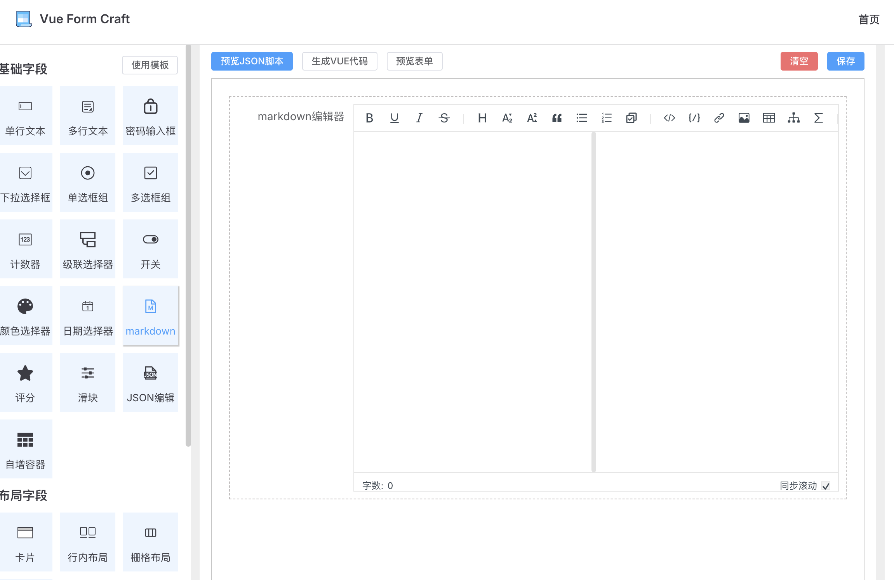

# 扩展一个markdown输入框

下面展示一下，如何给表单设计器扩展一个markdown输入框

## 创建目录

为了方便管理，我们将新扩展的组件放到一个目录下，这个目录下包含各个扩展组件的子目录

可以按照我的这种格式创建目录

```
src
└── extendElements
  └── index.ts
  └── Markdown
    └── attrSchema.ts
    └── Component.vue
    └── Icon.vue
    └── index.ts
```

## 安装markdown插件

可以在任意找一款开源的markdown插件，这里我选择了`md-editor-v3`

```xml
npm install md-editor-v3
```

## 封装markdown组件

组件需要接收`v-model`，来与表单建立数据双向绑定！

这里利用了`vue3.4+`的新api`defineModel`来快速实现！

```vue
// src/extendElements/Markdown/Component.vue
<template>
  <MdEditor v-model="value" />
</template>

<script setup lang="ts">
import { MdEditor } from 'md-editor-v3'
import 'md-editor-v3/lib/style.css'

const value = defineModel<string>()
</script>

```

## 封装Icon

在 [阿里iconfont](https://www.iconfont.cn/) 找一个合适的icon ，复制svg代码 ， 写到一个vue文件里即可！

**当然如果你项目里，有封装好的Icon渲染组件，可以直接用，跳过这一步！**

```vue
// src/extendElements/Markdown/Icon.vue
<template>
  <svg
    t="1726107434564"
    class="icon"
    viewBox="0 0 1024 1024"
    version="1.1"
    xmlns="http://www.w3.org/2000/svg"
    p-id="3897"
    width="20"
    height="20"
  >
    <path
      d="M854.6 288.6L639.4 73.4c-6-6-14.1-9.4-22.6-9.4H192c-17.7 0-32 14.3-32 32v832c0 17.7 14.3 32 32 32h640c17.7 0 32-14.3 32-32V311.3c0-8.5-3.4-16.7-9.4-22.7zM790.2 326H602V137.8L790.2 326z m1.8 562H232V136h302v216c0 23.2 18.8 42 42 42h216v494z"
      p-id="3898"
    ></path>
    <path
      d="M429 481.2c-1.9-4.4-6.2-7.2-11-7.2h-35c-6.6 0-12 5.4-12 12v272c0 6.6 5.4 12 12 12h27.1c6.6 0 12-5.4 12-12V582.1l66.8 150.2c1.9 4.3 6.2 7.1 11 7.1H524c4.7 0 9-2.8 11-7.1l66.8-150.6V758c0 6.6 5.4 12 12 12H641c6.6 0 12-5.4 12-12V486c0-6.6-5.4-12-12-12h-34.7c-4.8 0-9.1 2.8-11 7.2l-83.1 191-83.2-191z"
      p-id="3899"
    ></path>
  </svg>
</template>

```

## 配置项表单

通过设计器拖拽，制作的表单，将JsonSchema导了出来

```ts
// src/extendElements/Markdown/attrSchema.ts
import type { FormSchema } from 'vue-form-craft'

export default {
  size: 'small',
  labelAlign: 'top',
  items: [
    { label: '标签', component: 'Input', name: 'label' },
    {
      label: '唯一标识',
      component: 'Input',
      name: 'name',
      help: "既是唯一标识，也是数据路径。比如输入【props.name】，数据就会保存为 { props: { name:'xxx' } }"
    },
    { label: '字段说明', component: 'Textarea', name: 'help' },
    {
      label: '占位提示',
      component: 'Input',
      name: 'props.placeholder',
      designKey: 'form-ekRL'
    },
    { label: '初始值', component: 'Input', name: 'initialValue' },
    {
      component: 'Grid',
      children: [
        { label: '是否必填', component: 'Switch', name: 'required' },
        { label: '是否只读', component: 'Switch', name: 'props.readonly' },
        { label: '是否禁用', component: 'Switch', name: 'props.disabled' },
        { label: '隐藏字段', component: 'Switch', name: 'hidden' },
        { label: '隐藏标签', component: 'Switch', name: 'hideLabel' }
      ],
      props: {
        columns: 3,
        'row-gap': 0,
        'column-gap': 20
      },
      designKey: 'form-R003',
      name: 'cNmCuu',
      style: {
        marginBottom: 0
      }
    },
    { label: '自定义class', component: 'Input', name: 'props.class' },
    {
      label: '自定义style',
      component: 'JsonEdit',
      name: 'props.style',
      help: '与vue的style对象格式一样',
      dialog: true
    }
  ]
} as FormSchema
```

## 总配置

上面的几个文件，合并成一个`FormElement`对象，也就是一个完整的扩展组件！

```ts
// src/extendElements/Markdown/index.ts
import type { FormElement } from 'vue-form-craft'
import component from './Component.vue'
import icon from './Icon.vue'
import attrSchema from './attrSchema'

export default {
  name: 'markdown',
  component,
  icon,
  type: 'basic',
  order: 11,
  initialValues: { label: 'markdown编辑器', component: 'Markdown' },
  attrSchema
} satisfies FormElement
```

## 导出，使用

```ts
// src/extendElements/index.ts
import Markdown from './Markdown'

export default {
    Markdown
}
```

```ts
// main.ts
import { createApp } from 'vue'
import App from './App.vue'
import ElementPlus from 'element-plus'
import 'element-plus/dist/index.css'
import VueFormCraft from 'vue-form-craft'
import extendElements from './extendElements'

const app = createApp(App)

app.use(ElementPlus)
app.use(VueFormCraft, { extendElements })
app.mount('#app')

```

